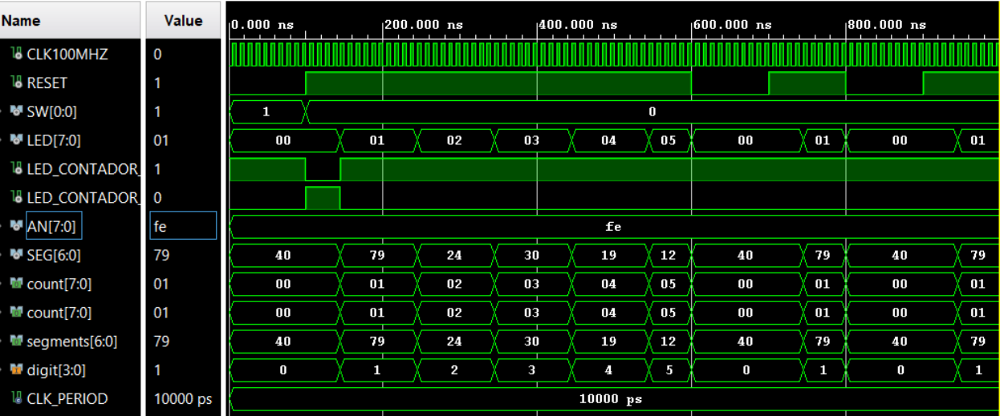
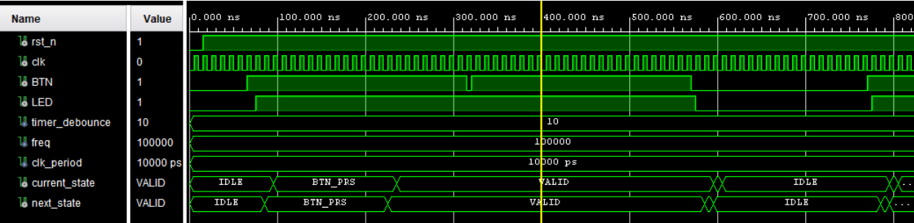
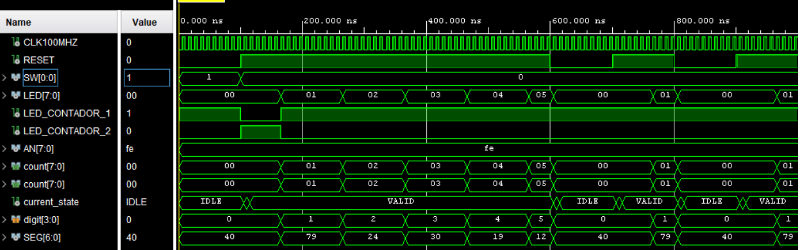

## Practica de Redundancia con debouncer

#Imagen que muestra ambos contadores sin debouncer 

Debouncer que muestra el efecto de presionar el boton(BTN)

Imagen con contadores y debouncer implementado

Trabajo realizado por Carmen Elizabeth Kilbourne y Santiago Valderrama